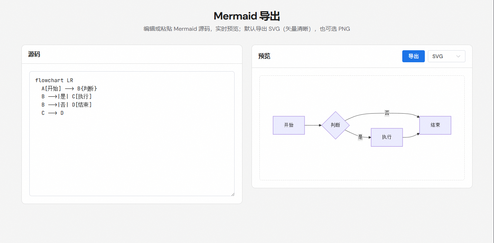

# Mermaid → Image

纯前端：在页面中编辑或粘贴 Mermaid 源码，实时预览并导出为 svg/png 图片。

## 界面截图



## 技术栈

- Vue 3 + Vite
- Element Plus
- Mermaid（浏览器内渲染）

## 使用

```bash
npm install
npm run dev
```

浏览器打开 http://localhost:5173/ 即可使用。

## 功能

- **编辑/粘贴**：左侧输入或粘贴 Mermaid 源码，支持 flowchart、sequenceDiagram、classDiagram 等
- **实时预览**：右侧自动渲染预览，语法错误会提示
- **导出**：点击「导出」下载；默认 SVG，可选 PNG

## 构建

```bash
npm run build
```

产出在 `dist/`，可部署到任意静态托管。

## 文档资源

README 等文档用的截图放在 **`docs/images/`** 下，避免堆在项目根目录，也便于和代码、构建产物区分。
